## TicketSoft - Microservicios

## Autores
- Jhorman Duvan Vacca Manzano
- Sebastian Ayala Suarez
- Jose Luis Nova Arguello

## Tiempos

### Sebastian Ayala
- Frontend
- Docker

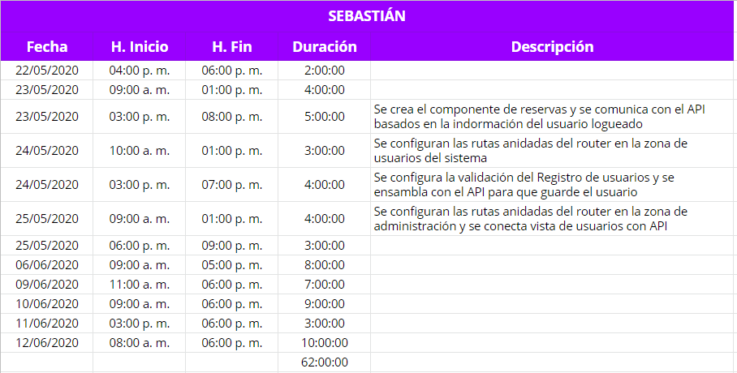

### Jhorman Duvan Vacca
- Backend

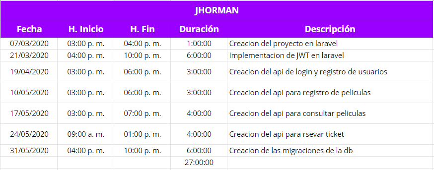

### Jose Luis Nova
- Base de datos
- Documentación


# Requisitos
- Xampp o Wamp
- PHP
- Node.js
- Composer
- Mysql

Este es el proyecto de una aplicacion web para la reserva de tickets.

## Roles de usuario:
- Administrador.
    - Gestiona toda la informacion relacionada con las peliculas, los horarios y la cantidad disponible de las mismas.
- Cliente
    - Tiene la posibilidad de reservar tickets para la peliculas que desee y posterior a esto podra puntuar dichas peliculas.

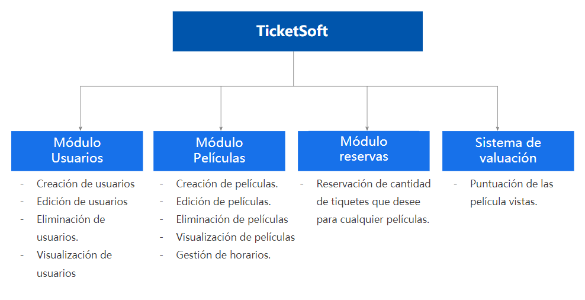

# Tecnologías

- Laravel
- Vue
- Mysql
- Docker

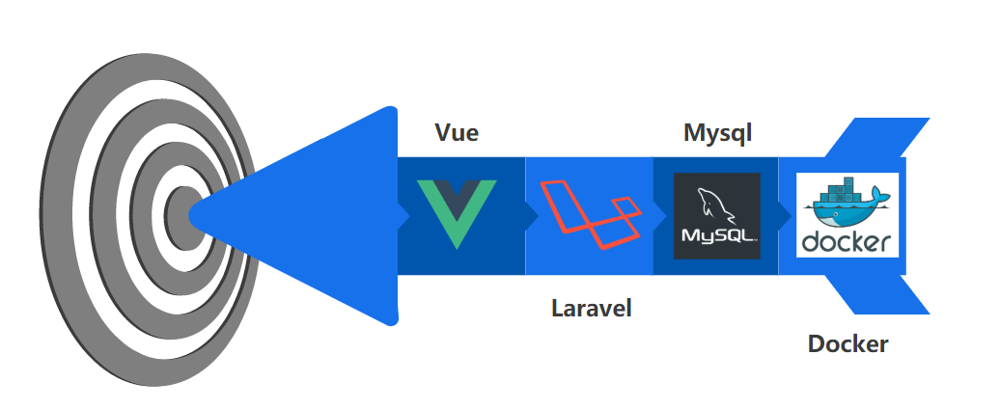

# Estructura Docker
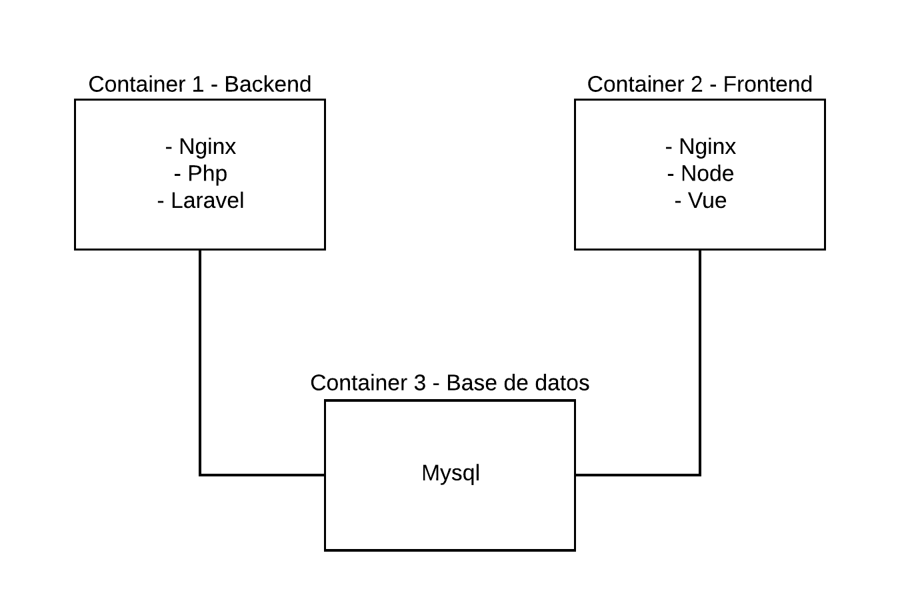

# Base de datos
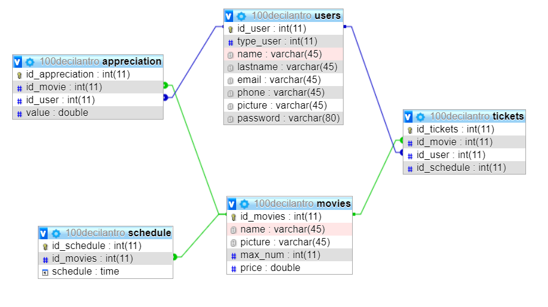

# Back-end
Esta sección refleja el back-end del proyecto, en el se encuentran un grupo de controladores a los que son accedidos por medio de las rutas de la api, modelos que son usados por los controladores y la configuración del JWT.

## Json Web Tokens
Los Json Web Tokens (JWT) nos permite crear un método de auteticación en servicios API para que nuestra conexión entre el cliente y nuestro back-end sea segura. 

Funciona de una forma sencilla, el cliente envía su usuario y contraseña, la API le retorna un token que enviará en todas las peticiones, para que ésta compruebe que tiene acceso a las acciones que se quieran realizar.

Instalando la libreria de JWT en laravel:
```
$ composer require tymon/jwt-auth:dev-develop --prefer-source
```
Generando el archivo de configuración:
```
$ php artisan vendor:publish --provider="Tymon\JWTAuth\Providers\LaravelServiceProvider"
```
Generando la llave para el proyecto:
```
$ php artisan jwt:secret
```

## Configurando modelo User
```
use Tymon\JWTAuth\Contracts\JWTSubject;
```
Implementando los metodos getJWTIdentifier() y getJWTCustomClaims().

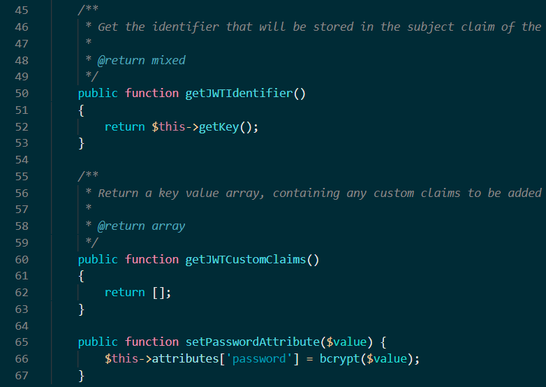

Por ultimo, para que laravel utilice como metodo de autenticación el JWT se debe modificar el archivo auth de la siguiente forma ubicado en ./config/auth.php

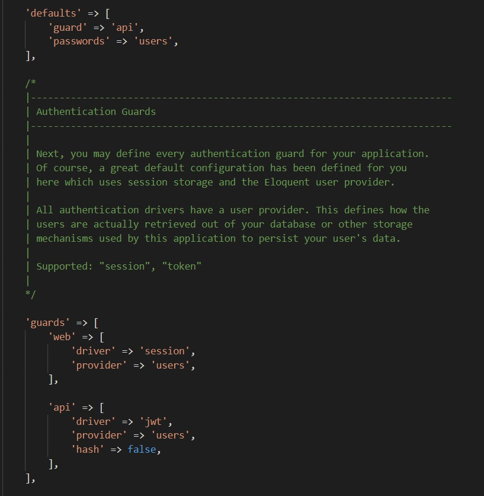

## Rutas
Las rutas son las encargadas de manejar el flujo de solicitudes. En estas se especifica el verbo HTTP a usar, el controlador al que va a entrar y el metodo al va a apuntar.

Estas rutas estan protegidas por medio de JWT(Json Web Tockens).

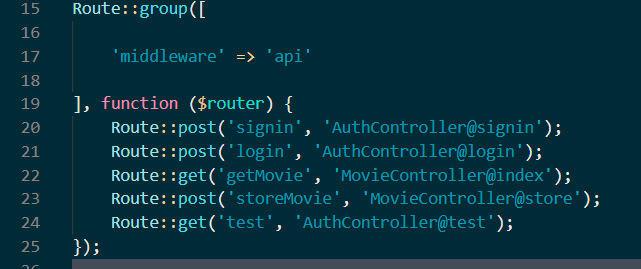

## Controlador
Son un mecanismo que ayuda agrupar la lógica de peticiones HTTP. 

Por ejemplo el caso de la ruta 'getMovie' que apunta al controlador 'MovieController' y al metodo 'index'.

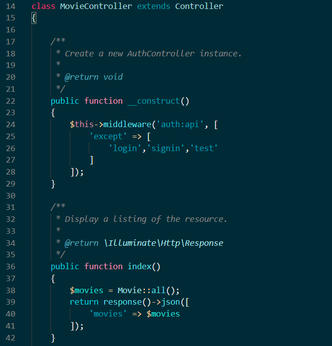

Cuando se recibe la petición según la ruta y el método HTTP respectivo, se instancia el controlador el cual, en su constructor, valida que el token esté vigente para responder según sea el caso.

# Front-end

Vue es un framework open source de JavaScript, el cual nos permite construir interfaces de usuarios de una forma muy sencilla. Se trabaja por medio de componentes. Un componente Vue, en términos simples, es un elemento el cual se encapsula código reutilizable, dentro de un componente podremos encontrar etiquetas HTML, estilos de CSS y código JavaScript.

## Requisitos
- Node.js
- Vue.cli
- Vuetify
- Axios
```
$ npm install -g @vue/cli
$ vue add vuetify
$ npm install axios
```
## Peticiones Front-end


Es un cliente HTTP basado en Promesas para Javascript, el cual puede ser utilizado en el Front-end, como en el Back-end por medio de Nodejs. Utilizando Axios, es muy sencillo enviar peticiones a endpoints REST y realizar operaciones CRUD. 
- Petición Post
    - axios.post(url, params)
- Peticion Get
    - axios.get(url, params)

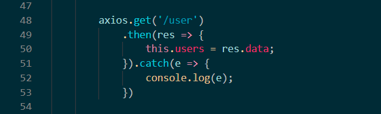

Axios en cada petición nos devuelve una promesa, la cual debemos manipular haciendo uso de los métodos .then/.catch para capturar la respuesta y los errores respectivamente.
