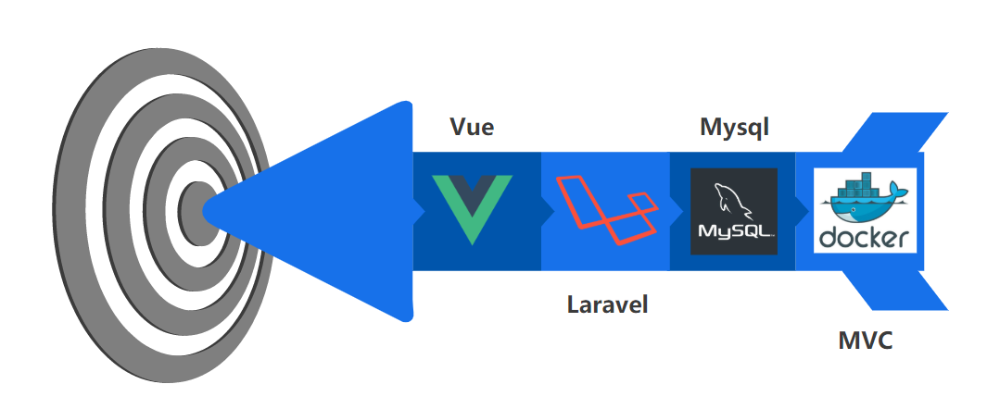

# 100deCilantro 
## TicketSoft - Microservicios


# Requisitos
- Xampp o Wamp
- PHP
- Node.js
- Composer
- Mysql


Este es el proyecto de una aplicacion web para la reserva de tickets.

Roles de usuario:
- Administrador.
    - Gestiona toda la informacion relacionada con las peliculas, los horarios y la cantidad disponible de las mismas.
- Cliente
    - Tiene la posibilidad de reservar tickets para la peliculas que desee y posterior a esto podra puntuar dichas peliculas.


# Tecnologías

- Laravel
- Vue
- Mysql



# Back-end
Esta sección refleja el back-end del proyecto, en el se encuentran un grupo de controladores a los que son accedidos por medio de las rutas de la api, modelos que son usados por los controladores y la configuración del JWT.

## Json Web Tockens
Los Json Web Token (JWT) nos permite crear un método de auteticación en servicios API para que nuestra conexión entre el cliente y nuestro back-end sea segura. 

Funciona de una forma sencilla, el cliente envía su usuario y contraseña, la API le retorna un token que enviará en todas las peticiones, para que ésta compruebe que tiene acceso a las acciones que se quieran realizar.

Instalando la libreria de JWT en laravel:
```
composer require tymon/jwt-auth:dev-develop --prefer-source
```
Generando el archivo de configuración:
```
$ php artisan vendor:publish --provider="Tymon\JWTAuth\Providers\LaravelServiceProvider"
```
Generando la llave para el proyecto:
```
$ php artisan jwt:secret
```

## Configurando modelo User
```
use Tymon\JWTAuth\Contracts\JWTSubject;
```
Implementando los metodos getJWTIdentifier() y getJWTCustomClaims().


Por ultimo, para que laravel utilice como metodo de autenticación el JWT se debe modificar el archivo auth de la siguiente forma ubicado en ./config/auth.php


## Rutas
Las rutas son las encargadas de manejar el flujo de solicitudes. En estas se especifica el verbo HTTP a usar, el controlador al que va a entrar y el metodo al va a apuntar.

Estas rutas estan protegidas por medio de JWT(Json Web Tockens).


## Controlador
Son un mecanismo que ayuda agrupar la lógica de peticiones HTTP. 

Por ejemplo el caso de la ruta 'getMovie' que apunta al controlador 'MovieController' y al metodo 'index'.


Cuando la petición entra al controlador se inicializa el constructor, este verifica si el JWT esta vigente, si lo esta, continua hacia el metodo que indica la ruta, de lo contrario generará un 401 (Unauthorized).

# Front-end
## Requisitos
- Vue.cli
- 
```
npm install -g @vue/cli
```
## Autores
- Jhorman Duvan Vacca Manzano
- Sebastian Ayala Suarez
- Jose Luis Nova Arguello